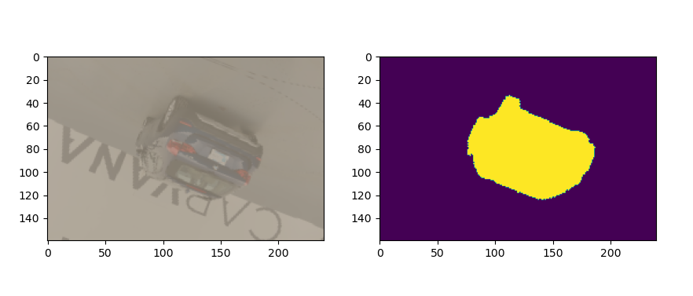
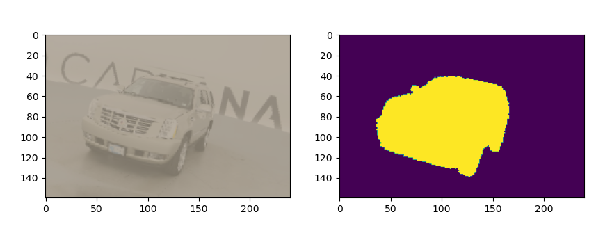
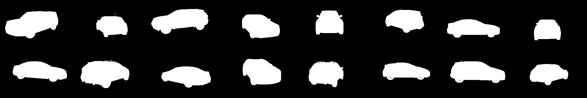

# Kaggle Carvana Car Image Segmentation
Download the data from [kaggle](https://www.kaggle.com/c/carvana-image-masking-challenge/data)
, you should have 2 folders and 1 csv file:

- train
- train_masks
- train_masks.csv

## Data
- [drive](https://drive.google.com/drive/folders/19_8oIEERDGQjqKbAkla3ZvM4qdJUcuM4?usp=sharing)
- Visualize data
 


## Train
```
python train.py
```
- After training you can see checkpoint file which saved model and optimizer state. 
- To load checkpoint you can change LOAD_MODEL to True

## Result
After 3 epochs: 
- Pixels accuracy is 99.19
- Dice score: 0.983
- Batch 0 of real masks 
- Batch 0 of predict masks
- 16 images for each batch
- The first image is real masks and to second is predict masks

 

