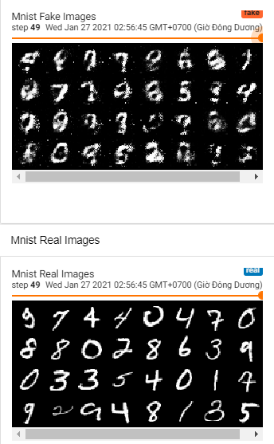

# Simple GAN
Tips: GAN is very tough and hard to converge, you have to modify the hyperparameter carefully. Otherwise you'll need to use some tricks to increase the accuracy and performance, for example:
- Use larger network / model or CNNs
- Better Normalization (BatchNorm)
- Learning rate with decay, schedule for optimizer
- Longer train - more epochs

## Result

## Source
- GAN paper