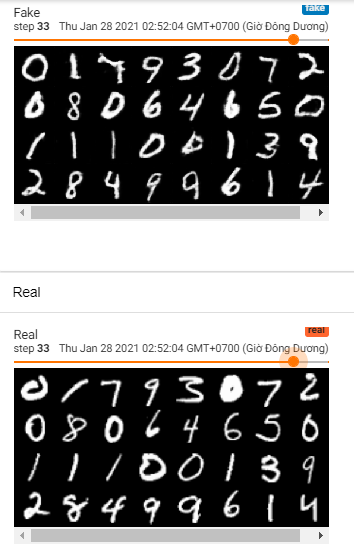

# Simple cGAN with MNIST
By using additional channel we can train the Generator with labels, so that the Generator will learn to generate the digits that we're asking it to do. We can see that after just 3 epochs the Generator can learn quite well, it can learn better when we train more. The digits in "Fake" will match the digits in "Real". You can use logs/ to plot tensorboard

## Result

## Source
- cGAN paper
- WP-GAN paper
- DCGAN paper